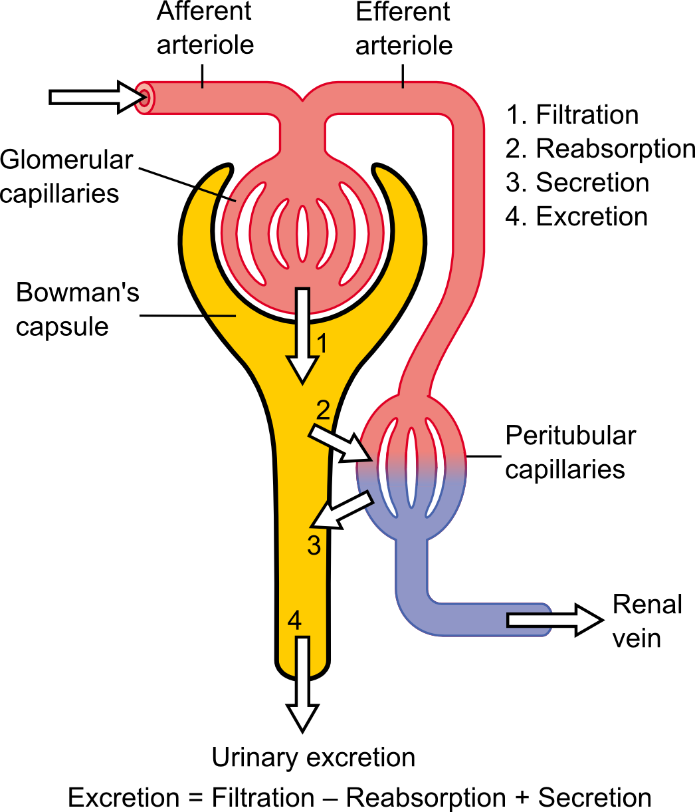

<!-- Limit image width and height -->
<style type='text/css'>
img {
    max-height: 560px;
    max-width: 964px;
}
</style>

<!-- Center image on slide -->
<script src="http://ajax.aspnetcdn.com/ajax/jQuery/jquery-1.7.min.js"></script>
<script type='text/javascript'>
$(function() {
    $("p:has(img)").addClass('centered');
});
</script>

## Read-And-Delete

1. Edit YAML front matter
2. Write using R Markdown
3. Use an empty line followed by three dashes to separate slides!

--- &twocol

## Glomerular Filtration Rate (GFR)

What is GFR?
- Glomerular filtration rate (GFR) describes the flow rate of filtered fluid through the kidney
- GFR may be accurately calculated by comparative measurements of substances in the blood and urine, or estimated by formulas using just a blood test result

*** =left

Why do we want to estimate GFR?
- Point 1 
- Point 2
- Point 3

*** =right





--- 

## CKD-EPI equation

The most widely used equation is the CKD-EPI equation:


$$
{\scriptstyle
\begin{equation*}
\begin{aligned}
  \log(GFR) &= \log(a) + \log\left(\min\left(\frac{Scr}{b_F},1\right)\right)c_F + \log\left(\max\left(\frac{Scr}{b_F},1\right)\right)d + \log(e)Age + \log(f)  && \quad \text{if} \> Sex = F \\
  & \\
  \log(GFR) &= \log(a) + \log\left(\min\left(\frac{Scr}{b_M},1\right)\right)c_M + \log\left(\max\left(\frac{Scr}{b_M},1\right)\right)d + \log(e)Age && \quad \text{if} \> Sex = M 
\end{aligned}
\end{equation*}
}
$$

There are also many other alternatives

--- 

## CKD-EPI equation performance for our data 


```r
x <- c(1,2,3,4)
```


